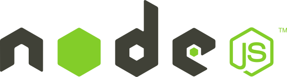
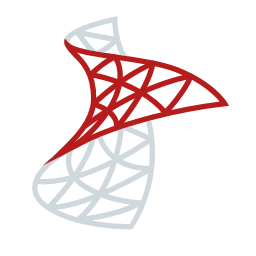

<h1 align="center">Welcome to my GitHub profile!</h1>
<h2>About me:</h2>

- ⏳ Right now: I'm studying CyberSec at Kea and working part time at Bonnier Publications.
- 📖 2024 goals: 
  * Make my own blogging website.
  * Create NAS
- 🚀 My goal is: To be one of the best programmers and help achieve big goals in the software industry!
- 💿 OS of choice: Debian - i3-wm
- 📝 Favorite editor: Micro and VSCode.

## Experience:
### Work experience:
 * **Maintained 40+ websites** - Bonnier Publications 2022-2024
    - Created many new features.
    - Was responsible for updating, releasing, optimizing and bug-fixing!
    - Was working with DevOps: <u>***Argo CD***</u> and <u>***GCP***</u>.
 * **Made a stack for a startup company** - Dreamplan 2022
    - <u>***React, Strapi***</u> and <u>***SQLite***</u>.  
### Development methodologies I've worked with:

<a href="https://en.wikipedia.org/wiki/Extreme_programming">💢Extreme Programming (XP)💢 </a>
<a href="https://en.wikipedia.org/wiki/Scrum_(software_development)"> 🔄Scrum🔄 </a>
<a href="https://en.wikipedia.org/wiki/DevOps"> ♾️DevOps♾️ </a>
<a href="https://en.wikipedia.org/wiki/Waterfall_model"> 💧Waterfall💧</a>

### Education:
* ***AP Degree in Computer Science*** - *Zealand 2020-2022*
* ***Bachelor in Cyber Security*** - *Kea 2024-2025*
## Languages and tools:
<table>
  <tr>
    <th>👨‍💻 - Fields</th>
    <th>📚 - Languages</th>
    <th>💾 - Programs/Tools</th>
  </tr>
  <tr>
    <td><b>Web Development:</b></td>
    <td>
<code></code>
<code></code>
<code></code>
<code></code>
<code></code>
<code></code>
<code></code>
<code></code>
<code></code>
<code></code>
    </td>
    <td> 
<code></code>
<code></code>
<code></code>
<code></code>
<code></code>
<code></code>
<code></code>
    </td>
  </tr>	
  <tr>
    <td><b>Server/Api Development:</b></td>
    <td>
<code></code>
<code></code>
<code></code>
    </td>
    <td> 
<code></code>
<code></code>
<code></code>
<code></code>
<code></code>
<code></code>
<code></code>
<code></code>
<code></code>
<code></code>
<code></code>
<code></code>
<code></code>
<code></code>
<code></code>
<code></code>
    </td>
  </tr>
  <tr>
    <td><b>Client Software Development:</b></td>
    <td>
<code></code>
<code></code>
    </td>
    <td>
<code></code>
<code></code>
    </td>
  </tr>
  <tr>
    <td><b>Android Development:</b></td>
    <td> 
<code></code>
<code></code>  
    </td>
    <td> 
<code></code>
    </td>
  </tr>
  <tr>
    <td><b>Machine Learning:</b></td>
    <td> 
<code></code>
    </td>
    <td>
<code></code>
<code></code>
<code></code>
    </td>
  </tr>
  <tr>
    <td><b>Cyber Security:</b></td>
    <td>
<code></code>
    </td>
    <td>
<code></code>
<code></code>
<code></code>
<code></code>
<code></code>
<code></code>
<code></code>
<code></code>
<code></code>
    </td>
  </tr>
  <tr>
    <td><b>IOT Development:</b></td>
    <td>
<code></code>
    </td>
    <td> 
<code></code>
<code></code>
    </td>
  </tr>
</table>

## Linux experience:
<table align="center">
<tr>
    <td>
<code></code>
<code></code> 
<code></code>
<code></code>
<code></code>
<code></code>
<code></code>
    </td>
</tr>
</table>

## My hardware and Tools:

  
Linux Desktop:

    <ul>
      <li><b>OS:</b> Arch + i3</li>
  		<li><b>Processor/CPU:</b> R9 5900X</li>
  		<li><b>Graphics Card/GPU:</b></li>
        <ol>
  			  <li>GTX 1660 Ti</li>
  				<li>GTX 750 Ti</li>
			  </ol>
  		<li><b>Memory/Ram:</b> 48GB 3600Mhz 16cl</li>
      <li><b>Storage:</b> Samsung PM9A1: R6500MB W4900MB</li>
      <li><b>Extra Storage:</b> 500GB SSD, 120GB SSD, 500GB HDD</li>
      <li><b>Monitors:</b></li>
			  <ol>
  				<li>32' 4K 60Hz</li>
          <li>24' 1080p 60Hz</li>
			  </ol>
		  <li><b>Cooling:</b></li>
        <ul>
  				<li><b>Thermal Paste:</b> T.G. Kryonaut (2*GPU & CPU)</li>
  				<li><b>Fans:</b> 4x Arctic BioniX P140 + 1x Pure Wings 2 140mm</li>
          <li><b>CPU Cooler:</b> NH-D15</li>
		    </ul>
	  </ul>

  
Work/Study Laptop:

    <ul> 
      <li><b>T480</b> 16Gb i7-8550U</li>
    </ul>

  
Home servers:

    <ul>
  		<li><b>Raspberry PI 4b</b> With 40mm fan - NAS</li>
  		<li><b>Raspberry PI 3b+</b> With 30mm fan - WebServer</li>
	  </ul>

  
Tools:

    <ul>
  		<li><b>MalDuino Elite</b> 2GB SD Card
      <li><b>T450 i7-5600U</b> 12Gb for pen-testing</li>
	  </ul>

