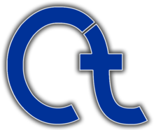

<h1 align="center">Welcome to my GitHub profile!</h1>
<h2>About me:</h2>

- ⏳ Right now: I'm studying IT-Security at Kea.
- 📖 2025 goals:
  - Create NAS.
  - Start making blogs on my website.
  - Make my own app!
- 🚀 My goal is: To be one of the best programmers and help achieve big goals in the software industry!
- 💿 OS of choice: Arch/NixOS - i3-wm -> [🐧 Config Files](https://github.com/GlebOlsen/LinuxConfFiles)
- 📝 Favorite editors:
  [🧬 Helix 🧬](https://helix-editor.com/) || [µ Micro µ](https://micro-editor.github.io/) || [z Zed z](https://zed.dev/) || VSCode
   

## Languages and tools:

<table>
  <tr>
    <th>👨‍💻 - Fields</th>
    <th>📚 - Languages</th>
    <th>💾 - Programs/Tools</th>
  </tr>
  <tr>
    <td><b>Web Development:</b></td>
    <td>

    </td>
    <td>

    </td>
  </tr>	
  <tr>
    <td><b>Server/Api Development:</b></td>
    <td>

    </td>
    <td> 

    </td>
  </tr>
  <tr>
    <td><b>Client Software Development:</b></td>
    <td>

    </td>
    <td>

    </td>
  </tr>
  <tr>
    <td><b>Android Development:</b></td>
    <td> 

  
    </td>
    <td> 

    </td>
  </tr>
  <tr>
    <td><b>Machine Learning:</b></td>
    <td> 

    </td>
    <td>

    </td>
  </tr>
  <tr>
    <td><b>Cyber Security:</b></td>
    <td>

<a href="https://www.gnu.org/software/software.en.html"> I echo GNU</a>
    </td>
    <td>

</td>
  </tr>
  <tr>
    <td><b>IOT Development:</b></td>
    <td>

    </td>
    <td> 

</td>
  </tr>
</table>

## Linux experience:

<table align="center">
<tr>
    <td>

 

    </td>
</tr>
</table>

Yes I have used all of them. <u><b>Each for at least 3 year min.</b></u> (exclude NixOS only used for 2 months).

## My hardware and Tools:

  
Linux Desktop:

    <ul>
      <li><b>OS:</b> Arch + i3</li>
  		<li><b>Processor/CPU:</b> R9 5900X</li>
  		<li><b>Graphics Card/GPU:</b></li>
        <ol>
  			  <li>RX 5700 XT Red Devil 3 fans</li>
	</ol>
  		<li><b>Memory/Ram:</b> 48GB 3600Mhz 16cl</li>
      <li><b>Storage:</b> Samsung PM9A1: R6500MB W4900MB</li>
      <li><b>Extra Storage:</b> 500GB SSD, 512GB SDD</li>
      <li><b>Monitors:</b></li>
			  <ol>
  				<li>32' 4K 60Hz</li>
          <li>24' 1080p 60Hz</li>
			  </ol>
		  <li><b>Cooling:</b></li>
        <ul>
  				<li><b>Thermal Paste:</b> T.G. Kryonaut (GPU & CPU)</li>
  				<li><b>Fans:</b> 4x Arctic BioniX P140 + 1x Pure Wings 2 140mm</li>
          <li><b>CPU Cooler:</b> NH-D15</li>
		    </ul>
	  </ul>

  
Work/Study Laptop:

    <ul> 
      <li><b>T480</b> 16Gb i7-8550U</li>
    </ul>

  
Home servers:

    <ul>
  		<li><b>Raspberry PI 4b</b> With 40mm fan - NAS</li>
  		<li><b>Raspberry PI 3b+</b> With 30mm fan - WebServer</li>
	  </ul>

  
Tools:

    <ul>
  		<li><b>MalDuino Elite</b> 2GB SD Card
      <li><b>T450 i7-5600U</b> 12Gb for pen-testing</li>
	  </ul>

